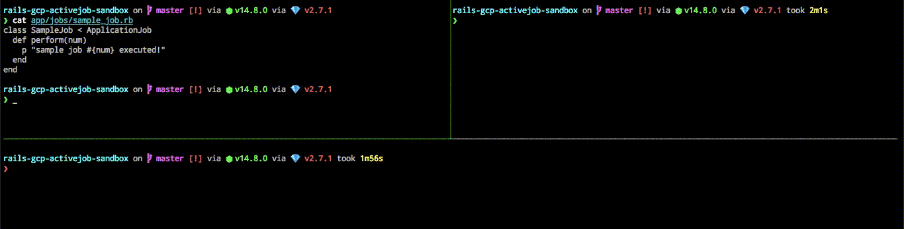

# Rails GCP ActiveJob Sandbox

## Use

Enqueue:

```irb
$ bin/rails c
Loading development environment (Rails 6.0.3.3)
irb(main):001:1* (1..5).each do |num|
irb(main):002:1*   SampleJob.perform_later(num)
irb(main):003:0> end
Enqueued SampleJob (Job ID: a6c9a627-802d-44ea-a7f5-01c47891f598) to (default) with arguments: 1
Enqueued SampleJob (Job ID: 786f2800-6ca9-4f48-aedd-2894e3c4c46f) to (default) with arguments: 2
Enqueued SampleJob (Job ID: d83a7b67-7ce1-428a-854a-01eec3ef17a7) to (default) with arguments: 3
Enqueued SampleJob (Job ID: 1521149f-373f-4f8b-964d-b9a9493505fa) to (default) with arguments: 4
Enqueued SampleJob (Job ID: 879c63cb-c971-482c-8db9-f4bce8397eaa) to (default) with arguments: 5
=> 1..5
```

Run worker:

```
$ bundle exec activejob-google_cloud_pubsub-worker --keyfile=config/gcp_credentials.json
```

## Demo

[](./demo.gif)
